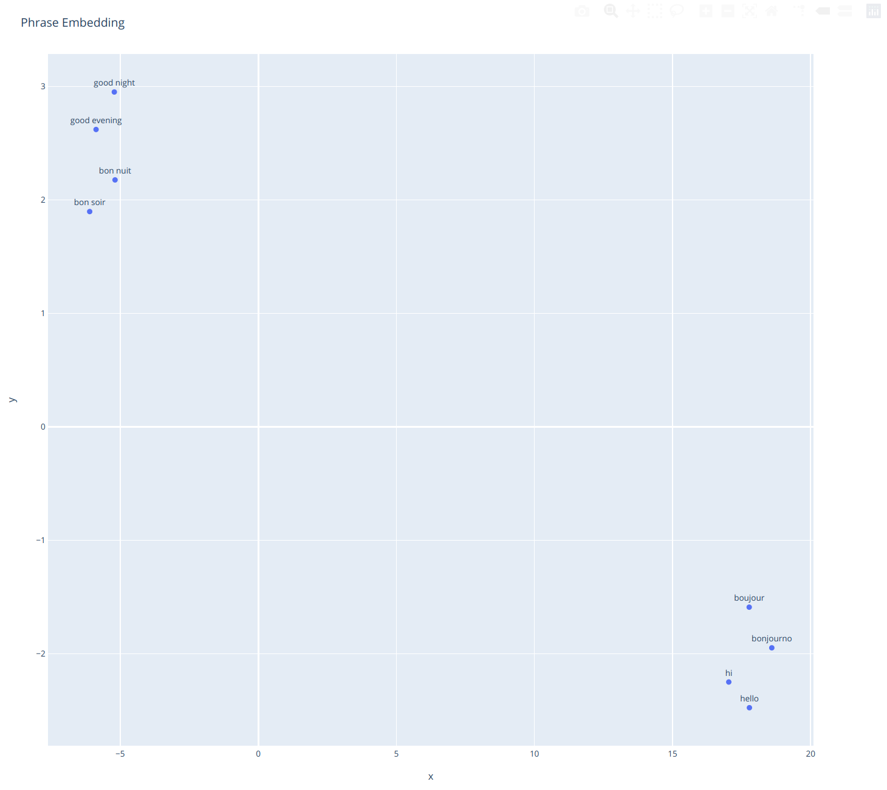

# crosslang_embed

Process multilingual phrases using embeddings. Combines translation, phrase embedding, embedding search, and embedding visualization.

Depends on:
- Universal Sentence Encoder https://tfhub.dev/google/universal-sentence-encoder-multilingual/3 See https://arxiv.org/abs/1803.11175
- Google Cloud Translate https://cloud.google.com/translate/docs

Partly based on https://colab.research.google.com/github/tensorflow/hub/blob/master/examples/colab/cross_lingual_similarity_with_tf_hub_multilingual_universal_encoder.ipynb

### Install

Prerequisites:
```
pip install -r requirements.txt
```

### Usage

Setup your google cloud platform credentials:
```
GOOGLE_CREDS_JSON = "path_to_google_creds_json"
GOOGLE_PROJECT_ID = "google_project_id"
```

Enter or load list of phrases you wish to translate:
```
phrase_list = ['hi', 'hello', 'bon nuit', 'bonjourno', 'boujour', 'bon soir', 'good night',
               'good evening']
```

Process phrases to translate them, get embeddings, and load embeddings.
```
mph.process_phrases(phrase_list)
```

Show all translations and languages:
```
print(mph.dfmain)

                        en src_lang
src                                
hello                hello       en
bonjourno            Hello       fr
good evening  good evening       en
bon soir      good evening       fr
hi                      hi       en
good night      good night       en
boujour              hello       fr
bon nuit        good night       fr
```

Find matches for a single phrase. Usually a limit around 0.9 is good:
```
df = mph.find_matches_index("salut", )
print( df[ df.dist<1.2].head(30) )

             en        phrase      dist lang
0            hi            hi  0.632794   en
1         hello         hello  0.639977   fr
2         hello       boujour  0.639977   en
3         Hello     bonjourno  0.812586   fr
4  good evening  good evening  1.050936   en
5  good evening      bon soir  1.050936   en
6    good night      bon nuit  1.083032   fr
7    good night    good night  1.083032   fr
```

Cluster phrases:
```
mph.umap_embeddings()
mph.plot_embeddings()
```


